# Getting started with EPM

This tutorial will provide a brief introduction on the EPM architecure and how you can use many EPM specific features.

Expected duration: 30 minutes

> [!NOTE]
> The content and screenshots for this tutorial have been created using DataMiner version 10.4.5.

## Prerequisites

- A DataMiner System that is [connected to dataminer.services](xref:Connecting_your_DataMiner_System_to_the_cloud).

## Overview

This tutorial consists of the following steps:

- [Step 1: Deploy the DataMiner EPM Integration Training package from the Catalog](#Step-1:-Deploy-the-DataMiner-EPM-Integration-Training-package-from-the-Catalog)
- [Step 2: Create a new Collector element and rebalance system](#Step-2:-Create-a-new-Collector-element-and-rebalance-system)
- [Step 3: Use EPM relations to filter out alarms](#Step-3:-Use-EPM-relations-to-filter-out-alarms)
- [Step 4: Using the EPM Feed in Dashboards and Low-Code Apps](#Step-4:-Using-the-EPM-Feed-in-Dashboards-and-Low-Code-Apps)
- [Step 5: Link EPM entities to Views](#Step-5:-Link-EPM-entities-to-Views)

## Step 1: Deploy the *DataMiner EPM Integration Training* package from the Catalog

1. Go to <https://catalog.dataminer.services/details/b661f936-d6e7-447c-baee-f0a5503e75b4>.

2. Deploy the Catalog item to your DataMiner Agent by clicking the *Deploy* button.
 
   > [!TIP]
   > See also: [Deploying a Catalog item to your system](xref:Deploying_a_catalog_item)

3. Open DataMiner Cube and check whether the following items have been added to your DataMiner Agent:

   - A view named *EPM Training*

   - A **Frontend** element named *EPM Training FE*

   - Two **Backend** elements named *EPM Training BE 1* and *EPM Training BE 2*

   - Three **Collector** elements names *EPM Training Collector 1* and *EPM Training Collector 2* and *EPM Training Collector 3*

   - The **Topoology app** in between the Surveyor and Activity module

> [!NOTE]
> If the Topology app does not show up right away, restart the Cube client

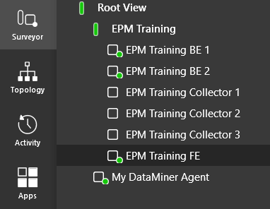

## Step 2: Create a new Collector element and rebalance system

1. Create a new **Collector** element in the EPM Training view called *EPM Training Collector 4* using the Skyline EPM Integration Training Collector protocol

    > [!NOTE]
    > If installed in a DMS cluster, create the **Collector** element on the same DMA as the EPM Training BE 2 element.

    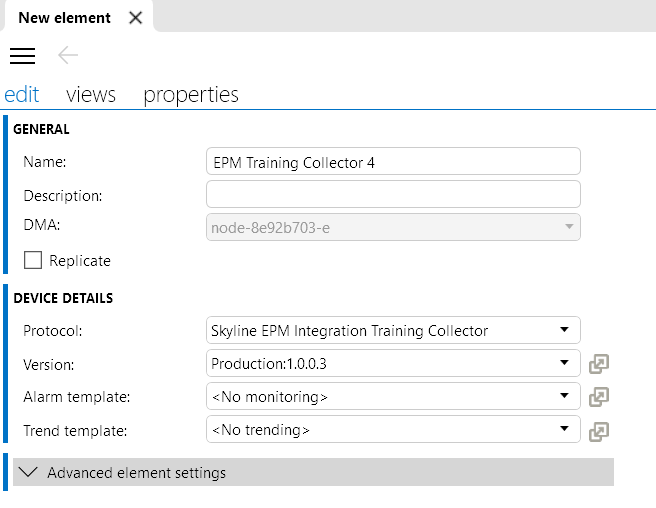

2. Copy the DMA ID/Element ID of the newly created **Collector** element. Easiest way is to view the element's properties

    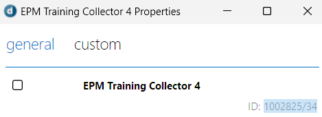

3. Open the *EPM Training BE 2* (1) element and navigate to the *Configuration* visual page (2) and then the *Collectors* tab (3). Add the new Collector DMA ID/Element ID to the registration table by pasting the **Collector DMA ID/Element ID's** in the textbox and pressing the *SET* button (4). This will make the *EPM Training BE 2* element the parent manager of the *EPM Training Collector 4* element.

     

4. Go to the **Frontend** configuration by selecting the *Configuration* Topology Chain in the **Topology** app (1) then navigate to the *Configuration* visual page (2) and then the *Collectors* tab (3). Add the new **Collector DMA ID/Element ID** to the registration table the same way as the Backend element
    
    

5. Navigate to the *General* visual page (1) and press the *Import* button (2) to intiate the Frontend provisioning cycle.

    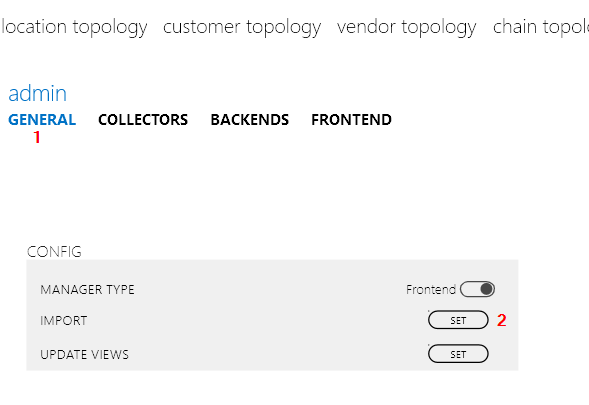

6. With that, the Manager drivers redistributed the load on the Collectors to prevent one element from having too much data. This can be confirmed by opening the *EPM Training Collector 4* element and seeing the *Number Endpoints parameter* filled on the *General* page.

    

## Step 3: Use EPM relations to filter out alarms

1. At this point, all of the collectors have pinged their endpoint devices and there are a lot of **Station** alarms created. This is caused because many of these **Stations** only have 1 **Endpoint** associated to them. You can filter these out to only show **Station** alarms where the issue is only present on the **Station**, and not an alarm on the **Hub** level, the parent entity.

2. Open the alarm template assigned to the *EPM Training FE* element. This can be done in the right click menu.

    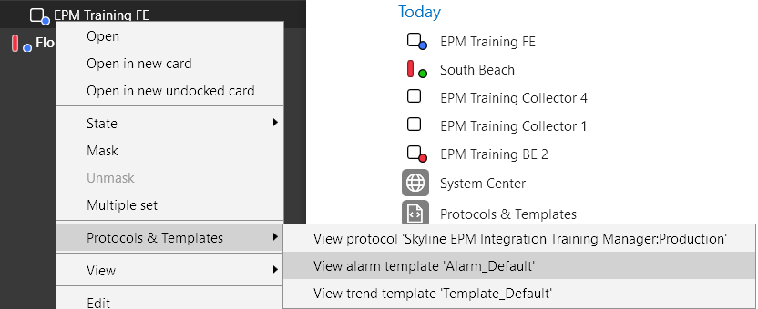

3. Navigate to the **Station** alarms, they should be all the way to the bottom. Take note of the row for *Percentage Unreachable Endpoints* and scroll all the way to the right. Under the conditions column, select that cell and *\<New>*

    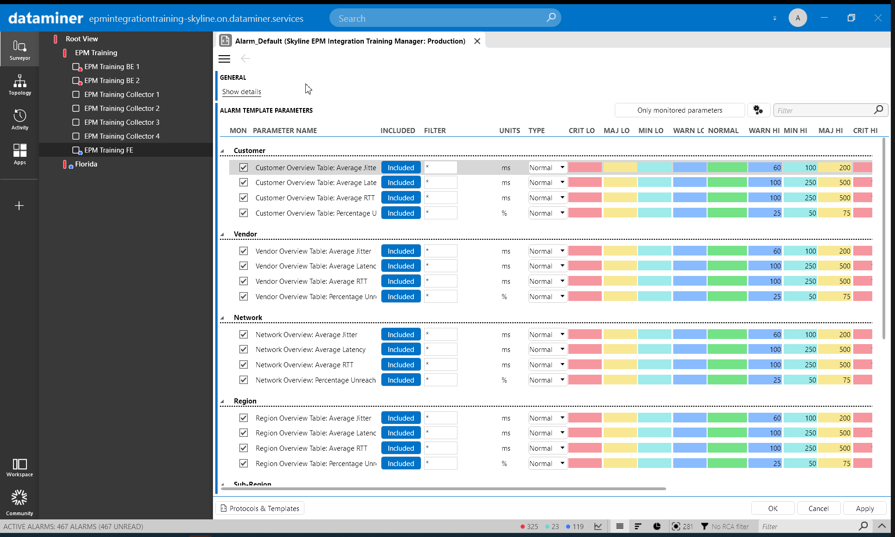

4. Here we will be creating the relation to filter any *Station Unreachable Endpoints* alarms when the parent Hub is also in alarm for the same KPI. Name the relation *Hub Relation*. Under the condition filter, select the *Hub Overview Table: Percentage Unreachable Endpoints* parameter. Change the *Equal to* comparer to *Greater than* and in the *\<Click to select>* field we will put 24.9 so if the parent hub has more than or equal to 25% Unreachable Endpoints the Station alarm will be ignored.

    

5. Hit Ok to save the condition and Ok again to save the alarm template and the system should have a large decrease in critical alarms.

## Step 4: Using the EPM Feed in Dashboards and Low-Code Apps

1. In the Dashboards module, create a folder called *Customer* under the Training folder. Then create a new dashboard called *01. Device Overview* in the new Customer folder.

    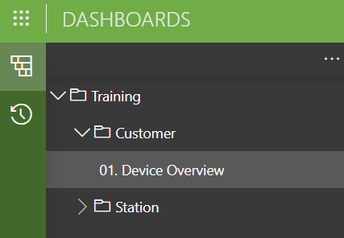

2. Add the EPM Feed component to the dashboard. You can quickly find it by searching *EPM* in the component search.

    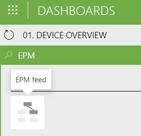

3. The EPM Feed component is an exclusive component that can only be linked to a Frontend EPM Manager element. To do so, add the EPM Training FE Element under the Elements tab in the Data section.

    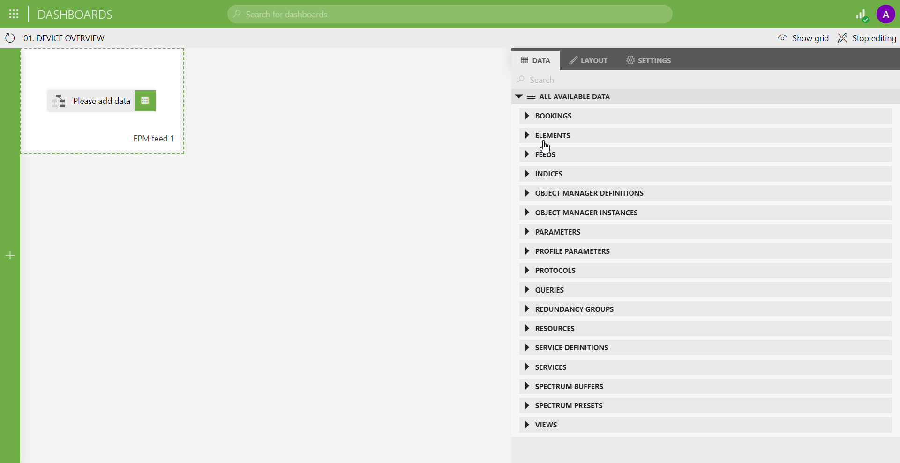

4. Now that the element data is in the component, the topology information needs to be configured. To do so, navigate to the settings section of the EPM Feed component and changing the CPE Chain from *Location Topology* to *Customer Topology* and then checking the Customer chain filter. Once configured, feel free to expand the component to fill in more of the dashboard.

    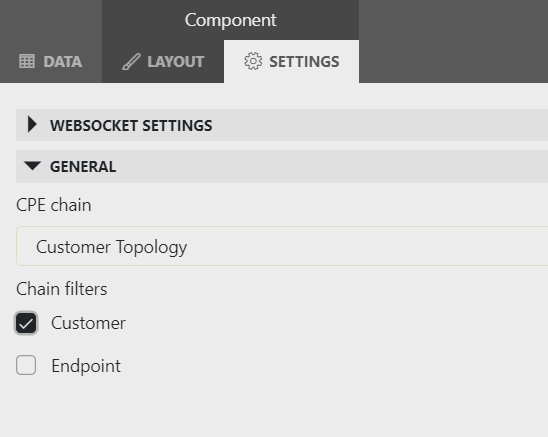

5. Back in the data section, go to the Queries section and create a new query. Name it *All Endpoints* and select the *Get parameters for elements where* data source. Select the Skyline EPM Integration Training Collector Protocol and then the Production version. 

6. Once the parameters populate, select the *Endpoint Overview Table*. Afterwards, select the *Select* operator and select the Index, IP, Customer, Jitter, Latency, Packet Loss Rate, and RTT parameters. 

7. Now that we have all the **Endpoint** information we want from all of the **Collectors**, we will now filter to only show the Endpoints associated to the Customer selected in the EPM Feed. Select Filter in the operator and select the *Customer Name* parameter. The Filter method will be *equals* and for the value, we will link the field to the EPM Feed component. Select the little chain icon on the right and then select *EPM Feed 1* for the feed and then the *System name* property. Once done it should look like this: 

    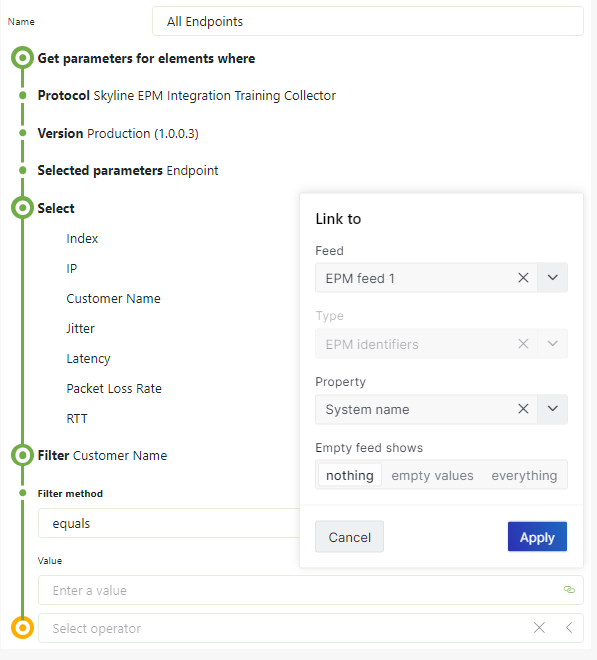

8. Drag the Query into the dashboard to create an empty component. Once created, hover over the component and select the Pie Graph icon to change the component to a Table component.

    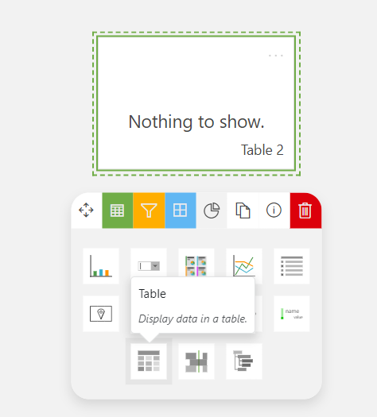

9. Once the table component has been created, stretch it out to cover the remaining white space and stop editing the dashboard. It should look similar to this 

    

10. Now selecting a Customer on the EPM Feed will update the table below to show all of the Endpoints associated to the selected Customer.

    

## Step 5: Link EPM entities to Views

1. Create a View under the Root view called *Florida*, then a view under the Florida view called *Miami*, and finally a view under the Miami view called *South Beach*. This is to simulate the tree structure of the relationships.

    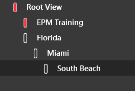

2. Navigate to the Frontend configuration page (can be accessed by selecting the Configuration Topology Chain in the Topology app) and press the Update Views button on the General page

    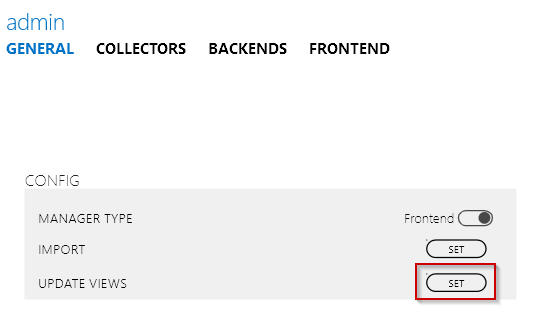

5. All of the views are now linked to their EPM objects and inherit their alarm properties from the EPM entity. Selecting any of the views will show a data section displaying the EPM KPI infromation.

    