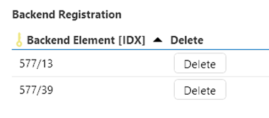

# View Tables
The Frontend is able to display all of the infromation in the system with View tables. The primary way to do so is through the use of the [directView](https://docs.dataminer.services/develop/schemadoc/Protocol/Protocol.Params.Param.ArrayOptions-options.html#directview) option since the Frontend and Backend elements use the same driver so the table structures are identical. Below is an example of a directView table:

```xml
<Param id="8500">
<Name>view_regionOverviewTable</Name>
<Description>View_Region Overview Table</Description>
<Type>array</Type>
<ArrayOptions index="0" options=";volatile;naming=/8502;view=8000;directView=801;onlyFilteredDirectView" partial="true:200">
    <ColumnOption idx="0" pid="8501" type="retrieved" options=";view=8001"/>
    <ColumnOption idx="1" pid="8502" type="retrieved" options=";view=8002"/>
    <ColumnOption idx="2" pid="8503" type="retrieved" options=";view=8003"/>
    <ColumnOption idx="3" pid="8504" type="retrieved" options=";disableHeaderSum;disableHistogram;disableHeatmap;view=8004"/>
    <ColumnOption idx="4" pid="8505" type="retrieved" options=";disableHeaderSum;disableHistogram;disableHeatmap;view=8005"/>
    <ColumnOption idx="5" pid="8506" type="retrieved" options=";disableHeaderSum;disableHistogram;disableHeatmap;view=8006"/>
    <ColumnOption idx="6" pid="8507" type="retrieved" options=";disableHeaderSum;disableHistogram;disableHeatmap;view=8007"/>
    <ColumnOption idx="7" pid="8508" type="retrieved" options=";disableHeaderSum;disableHistogram;disableHeatmap;view=8008"/>
    <ColumnOption idx="8" pid="8509" type="retrieved" options=";disableHeaderSum;disableHistogram;disableHeatmap;view=8009"/>
    <ColumnOption idx="9" pid="8510" type="retrieved" options=";disableHeaderSum;disableHistogram;disableHeatmap;view=8010"/>
    <ColumnOption idx="10" pid="8511" type="retrieved" options=";disableHeaderSum;disableHistogram;disableHeatmap;view=8011"/>
    <ColumnOption idx="11" pid="8512" type="retrieved" options=";disableHeaderSum;disableHistogram;disableHeatmap;view=8012"/>
    <ColumnOption idx="12" pid="8513" type="retrieved" options=";disableHeaderSum;disableHistogram;disableHeatmap;view=8013"/>
    <ColumnOption idx="13" pid="8514" type="retrieved" options=";disableHeaderSum;disableHistogram;disableHeatmap;view=8014"/>
</ArrayOptions>
```

### Important ArrayOptions options
-	[View=](https://docs.dataminer.services/develop/schemadoc/Protocol/Protocol.Params.Param.ArrayOptions-options.html#view): the tablePid where the View Table will retrieve all of the information.
-	[directView=]((https://docs.dataminer.services/develop/schemadoc/Protocol/Protocol.Params.Param.ArrayOptions-options.html#directview)): columnPid where the unique Backend DMA ID/Element ID’s are listed. 
-	[onlyFilteredDirectview](https://docs.dataminer.services/develop/schemadoc/Protocol/Protocol.Params.Param.ArrayOptions-options.html#onlyfiltereddirectview:) helps with system load.

### Important ColumnOption options
- [View=](https://docs.dataminer.services/develop/schemadoc/Protocol/ColumnOptionOptionsOverview.html#view-1): the columnPid where the information exists that will be shown in this column.

--NOTE
There are options to view information outside of the element using the remoteView syntax view=linkedPid:elementKeyColumnPid:remoteDataTablePid:remoteDataColumnIdx. This is **NOT RECOMMENDED** if you are expecting to retrieve remote data from a large amount of entities, more than 20k entities will cause increased load in SLNet. This is because Dataminer handles those subscriptions by requesting all of the collector elements.


### Example

Using the example above, we are mapping the information found in table 8000 to a view table 8500. Below is the table declaration of table 8000:
```xml
<Param id="8000">
<Name>regionOverviewTable</Name>
<Description>Region Overview Table</Description>
<Type>array</Type>
<ArrayOptions index="0" options=";naming=/8002" partial="true:200">
    <ColumnOption idx="0" pid="8001" type="retrieved" options=""/>
    <ColumnOption idx="1" pid="8002" type="retrieved" options=""/>
    <ColumnOption idx="2" pid="8003" type="retrieved" options=";foreignKey=9000"/>
    <ColumnOption idx="3" pid="8004" type="retrieved" options=";disableHeaderSum;disableHistogram;disableHeatmap"/>
    <ColumnOption idx="4" pid="8005" type="retrieved" options=";disableHeaderSum;disableHistogram;disableHeatmap"/>
    <ColumnOption idx="5" pid="8006" type="retrieved" options=";disableHeaderSum;disableHistogram;disableHeatmap"/>
    <ColumnOption idx="6" pid="8007" type="retrieved" options=";disableHeaderSum"/>
    <ColumnOption idx="7" pid="8008" type="retrieved" options=";disableHeaderSum;disableHistogram;disableHeatmap"/>
    <ColumnOption idx="8" pid="8009" type="retrieved" options=";disableHeaderSum"/>
    <ColumnOption idx="9" pid="8010" type="retrieved" options=";disableHeaderSum;disableHistogram;disableHeatmap"/>
    <ColumnOption idx="10" pid="8011" type="retrieved" options=";disableHeaderSum"/>
    <ColumnOption idx="11" pid="8012" type="retrieved" options=";disableHeaderSum;disableHistogram;disableHeatmap"/>
    <ColumnOption idx="12" pid="8013" type="retrieved" options=";disableHeaderSum"/>
    <ColumnOption idx="13" pid="8014" type="retrieved" options=";disableHeaderSum;disableHistogram;disableHeatmap"/>
    <ColumnOption idx="14" pid="8015" type="retrieved" options=";viewImpact"/>
</ArrayOptions>
```

You can see that all of the columns map to columns in the local table, I.E. view column 8501 maps to local column 8001, view column 8502 maps to local column 8002, etc.

And using the directView option, subscribing and requesting the information to all Backends in columnPid 801 containing the following ID's



### View table Column Parameters
Since we are essentially just duplicating the information from the local table to a view table, it is not necesarry to recreate all of the parameter declarations from the local table. Because of this the view table parameters are comprised of [duplicateAs](https://docs.dataminer.services/develop/schemadoc/Protocol/Protocol.Params.Param-duplicateAs.html) columns to save on having to copy the parameter definition.

```xml
<Param id="8001" trending="false" duplicateAs="8501">
    <Name>regionOverviewIndex</Name>
    <Description>Index (Region Overview)</Description>
    <Information>
        <Subtext>This is the key used internally by DataMiner to identify the table entries.</Subtext>
    </Information>
    <Type>read</Type>
    <Interprete>
        <RawType>other</RawType>
        <LengthType>next param</LengthType>
        <Type>string</Type>
    </Interprete>
    <Display>
        <RTDisplay>true</RTDisplay>
    </Display>
    <Measurement>
        <Type>string</Type>
    </Measurement>
</Param>
```